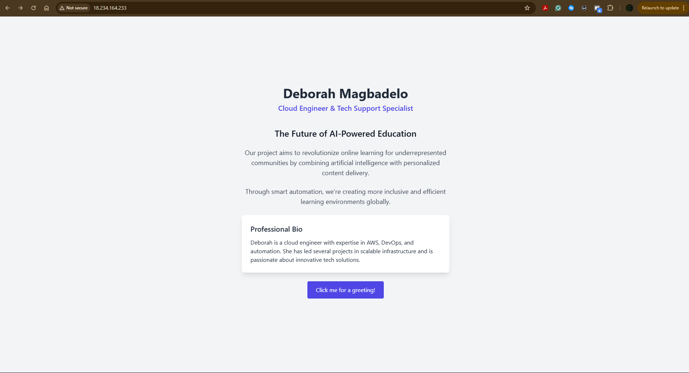

# Cloud Engineering Project – Dynamic Landing Page Deployment on AWS EC2

## ✨Project Overview
This project demonstrates a full deployment workflow using AWS EC2, Nginx, and a Node.js backend to simulate a reverse proxy setup for a dynamic landing page. It showcases the following:
- Provisioning a cloud server
- Securing and configuring the server
- Hosting a dynamic web page with Tailwind CSS & JavaScript
- Configuring a reverse proxy from Nginx to a backend Node.js app

## 📌Hosted Page
- The landing page is accessible via: http://18.234.164.233
- Node.js page: http://18.234.164.233/node

## 🔧Server Provisioning
- Ubuntu 24.04 LTS instance on AWS EC2.
- Security group configured to allow inbound HTTP (port 80), HTTPS (port 443), and SSH (port 22, restricted to my IP).

## 🔧Web Server Setup
- Installed Nginx to serve the landing page.
- The landing page is located at `/var/www/html/index.html`.

## 🔧Dynamic Landing Page
- Personalized landing page with my name, role, project title, pitch, and bio.
- Styled using Tailwind CSS via CDN with subtle animations.

## 🔧Networking & Security
- Ports 80 and 443 are open in the EC2 security group.
- SSL with Let's Encrypt was **not configured** because a domain name is required to obtain a valid certificate.
- HTTPS port is open for future SSL enablement once a domain is configured.

## 🔧Nginx Reverse Proxy
- Installed Node.js and created a minimal Node.js app listening on port 3000
- Configured /etc/nginx/sites-available/default to reverse proxy traffic from Nginx to the Node.js app

## ✅Features
- Dynamic, responsive design with Tailwind
- JavaScript-enhanced interactivity
- Node.js backend proxied via Nginx
- Hosted on AWS with open access over HTTP

## 📸Screenshot


## 🧐Author
Deborah Magbadelo  
*Cloud Engineer & Tech Support Specialist*

## 📁Repo Contents
```
├── index.html           # Landing page
├── server.js            # Node.js reverse proxy backend
├── exam-project.png     # Screenshot of the live page
└── README.md            # This documentation
```

## 📬Contact
- GitHub: @debbymags  
- Email: debbymags@gmail.com
---

